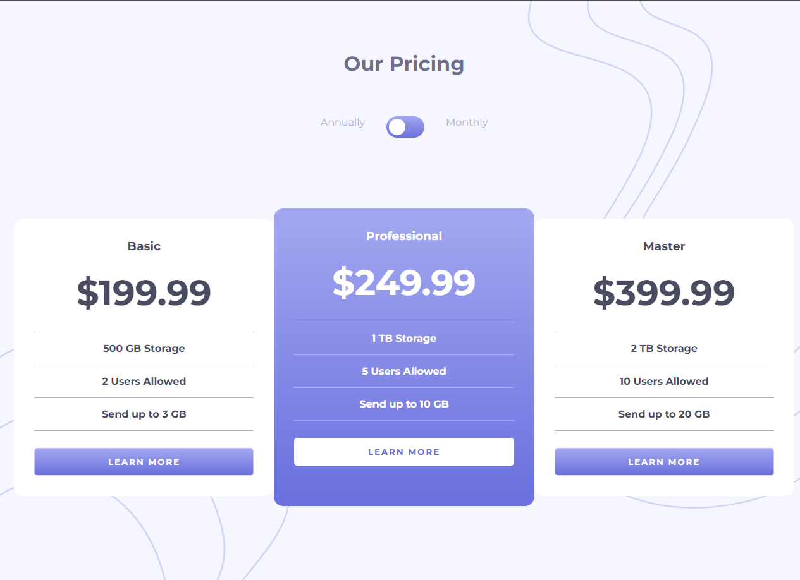

## Table of contents

- [Overview](#overview)
  - [Screenshot](#screenshot)
  - [Links](#links)
- [My process](#my-process)
  - [Built with](#built-with)
  - [Continued development](#continued-development)
- [Author](#author)

## Overview

Users should be able to:

- View plan pricing according to the toggle switches position.
- View the optimal layout for the component depending on their device's screen size

### Screenshot

### Links

- Live Site URL: https://afarrell95.github.io/pricing-component/

### Built with

- Semantic HTML5 markup
- CSS custom properties
- Flexbox
- JavaScript

### Continued development

TODO:

- Control the toggle with both their mouse/trackpad and their keyboard

## Author

email: farrella95@gmail.com
